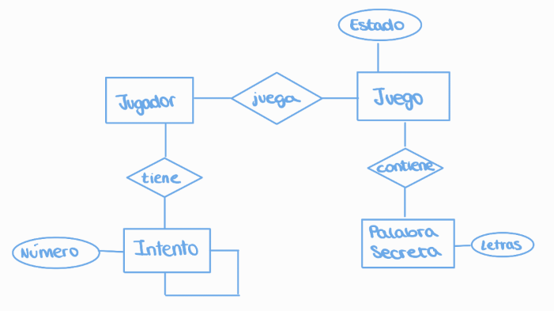

# JUEGO ADIVINAR UNA PALABRA

## OBJETIVO DEL JUEGO:
El objetivo del juego es adivinar una palabra secreta letra por letra hasta descubrir la palabra completa.

## REGLAS DEL SISTEMA:
    a) Se elige una palabra secreta, que es la palabra que el jugador debe adivinar. La palabra secreta se mantiene oculta al principio del juego.
    
    b) En cada turno, el jugador puede adivinar una letra escribiéndola por consola. 

    c) Si la letra adivinada está presente en la palabra secreta, se revelará su ubicación en la palabra secreta. El jugador puede seguir adivinando más letras hasta completar la palabra o agotar el número de intentos.

    d) Si la letra adivinada no está en la palabra secreta, se informará al jugador que su adivinanza fue incorrecta.

    e) El juego continúa hasta que el juagador adivine la palabra o se agoten los intentos.

## MODELO CONCEPTUAL:

## EJECUCIÓN 
Cargamos el archivo con el juego: 
    
    $consult('adivinar.pl').
    
Iniciamos el juego: 

    $inciar_juego.

Para adivinar una letra de la palabra: 

    $adivinar(letra)
    
donde letra representa cualquier letra del abecedario en minúscula. 

## AUTORES
* **Miriam Jiménez**
* **Enrique Collado**

## LICENCIA:
Copyright 2023, **Miriam Jiménez** and **Enrique Collado**.

Licensed under the Apache License, Version 2.0 (the "License");
you may not use this file except in compliance with the License.
You may obtain a copy of the License at

    http://www.apache.org/licenses/LICENSE-2.0

Unless required by applicable law or agreed to in writing, software distributed under the License is distributed on an "AS IS" BASIS,  WITHOUT WARRANTIES OR CONDITIONS OF ANY KIND, either express or implied.See the License for the specific language governing permissions and limitations under the License.

