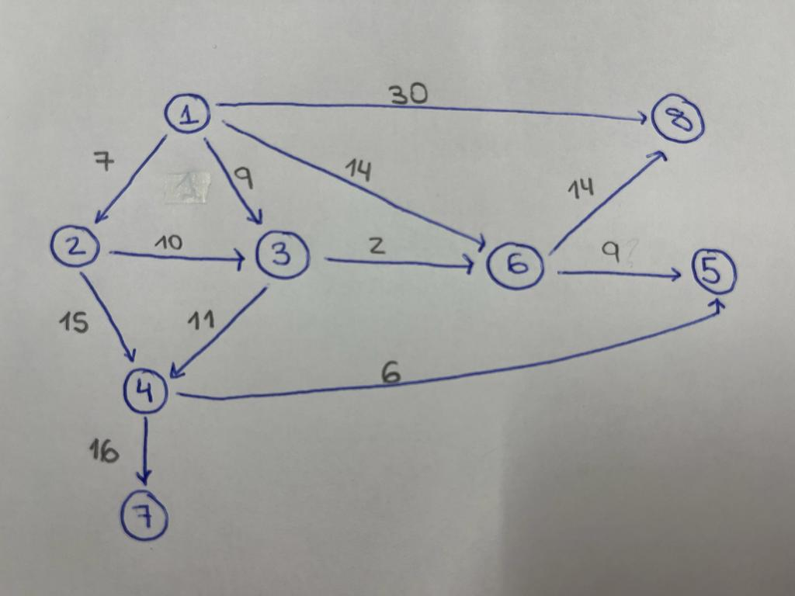

# BÚSQUEDA HEURÍSTICA SIN ADVERSARIOS

## AUTORES
* **Miriam Jiménez**
* **Enrique Collado**

## OBJETIVO DE ESTA PRÁCTICA:
El propósito de esta práctica es reutilizar código que implementa el algoritmo A*. Se bajará código de Github, y se utilizará para ejecutar este algoritmo para un grafo concreto.

- Repositorio con el código de algoritmos y estructuras de datos en Java de Justin Wetherell:
https://github.com/phishman3579/java-algorithms-implementation.git

## SOBRE EL PROYECTO
- El grafo implementado en la clase Main.java ubicado dentro del paquete aplicacion es el siguiente:

- Este proyecto esta elaborado dentro de una maquina Ubuntu.
- Para instalar ant en ubuntu :

        $sudo apt install ant

## EJECUCIÓN 
Ejecutamos el proyecto con los cambios indicados en build.xml:

    $ant run_main

Tras ejecutar este comando, el output es el siguiente:
        
        run_main:
        [java] [[ 1(0) ] -> [ 3(0) ] = 9
        [java] , [ 3(0) ] -> [ 6(0) ] = 2
        [java] , [ 6(0) ] -> [ 8(0) ] = 14
        [java] ]
El output representa el camino encontrado por el algoritmo A* al ejecutarlo en el grafo proporcionado. La interpretación del output es la siguiente:

[ 1(0) ] -> [ 3(0) ] = 9: Este fragmento indica que el camino va desde el vértice 1 hasta el vértice 3 con un costo de 9.

[ 3(0) ] -> [ 6(0) ] = 2: Indica que el camino continúa desde el vértice 3 hasta el vértice 6 con un costo de 2.

[ 6(0) ] -> [ 8(0) ] = 14: Finalmente, el camino va desde el vértice 6 hasta el vértice 8 con un costo de 14.

## PREGUNTAS

#### 1. ¿Qué variable representa la lista ABIERTA?
La variable que representa la lista ABIERTA es openSet. 
Esta lista contiene los nodos que aún no han sido evaluados y que son candidatos para ser explorados en el algoritmo A*.

#### 2. ¿Qué variable representa la función g?
La variable que representa la función g es gScore. Es un mapa que almacena el costo acumulado desde el inicio hasta cada vértice a lo largo del mejor camino conocido.

#### 3. ¿Qué variable representa la función f ?
La variable que representa la función f es fScore. Es un mapa que almacena la estimación del costo total desde el inicio hasta el objetivo a través de un vértice específico.

#### 4. ¿Qué método habría que modificar para que la heurística representarala distancia aérea entre vértices?
Para que la heurística represente la distancia aérea entre vértices, habría que modificar el método heuristicCostEstimate(Graph.Vertex<T> start, Graph.Vertex<T> goal). 
Actualmente, este método devuelve un valor constante (1 por defecto).

#### 5. ¿Realiza este método reevaluación de nudos cuando se encuentra una nueva ruta a un determinado vértice? 
Sí, el método aStar realiza la reevaluación de nodos cuando se encuentra una nueva ruta a un determinado vértice. Esto se hace en el siguiente bloque de código:

        if (tenativeGScore >= gScore.get(neighbor))
            continue;
Aquí, si la nueva ruta encontrada tiene un costo acumulado mayor o igual al costo acumulado conocido hasta el momento para ese vecino, entonces la nueva ruta no se considera y se continúa con la exploración de otros vecinos. Esto asegura que solo se conserven las rutas más cortas y eficientes.

## LICENCIA:
Copyright 2023, **Miriam Jiménez** and **Enrique Collado**.

Licensed under the Apache License, Version 2.0 (the "License");
you may not use this file except in compliance with the License.
You may obtain a copy of the License at

    http://www.apache.org/licenses/LICENSE-2.0

Unless required by applicable law or agreed to in writing, software distributed under the License is distributed on an "AS IS" BASIS,  WITHOUT WARRANTIES OR CONDITIONS OF ANY KIND, either express or implied.See the License for the specific language governing permissions and limitations under the License.

