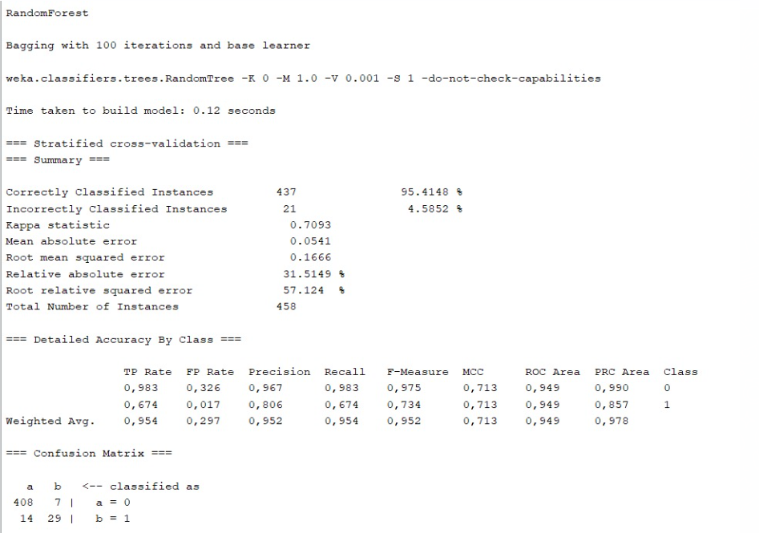
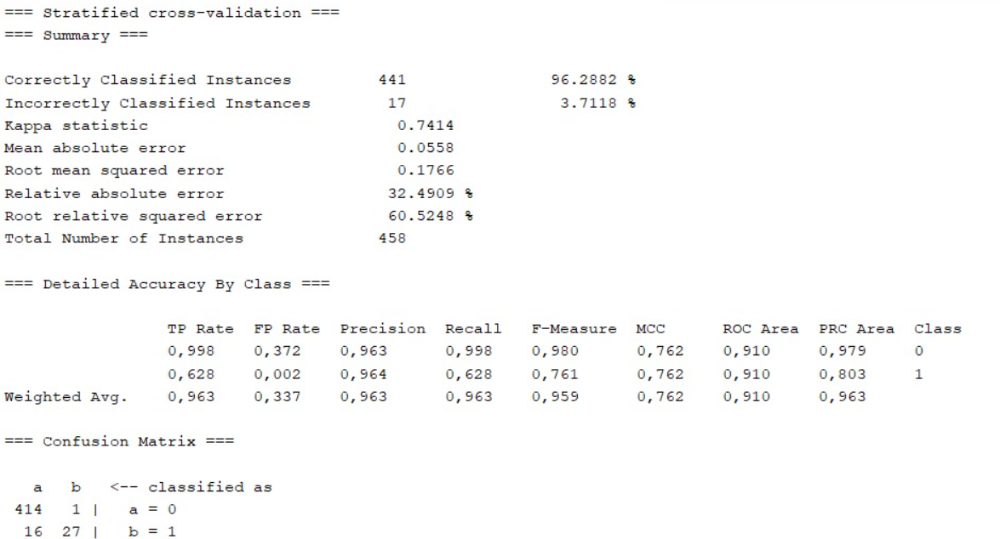

# **P3 - APRENDIZAJE AUTOMÁTICO**

## AUTORES
* **Miriam Jiménez**
* **Enrique Collado**

## PASOS A REALIZAR 

### **1. Elegir el Problema**

#### THE HUNGER GAMES

En este proyecto, vamos a explorar un conjunto de datos vinculados a "The Hunger Games", con el objetivo de preveer quién se convertirá en el ganador del juego en función de diversos parámetros.

Este juego es una competicion ficticia en la que tenemos 24 participantes de diferentes distritos numerados del 1 al 12, ordenados de más ricos (mejores condiciones) a más pobres (peores condiciones), habiendo 2 participantes de cada distrito. Los participantes se enfrentan en una lucha a muerte hasta que solo queda 1 o 2 ganadores, en el caso de que pertenezcan al mismo distrito.

Los factores importantes a considerar para identificar a los competidores más propensos a ganar son los siguientes:

 - Los distritos mas pequeños (1,2,3,etc) tienen más recursos para entrenar, lo que aumenta sus posibilidades de victoria.
 
 - Cada distrito envía a 2 participantes, permitiendo la posibilidad de que ambos ganen ya que pertenecen al mismo distrito. No es posible que 2 personas de diferentes distritos ganen. Si no sobreviven ambos, puede haber un solo ganador.

 - Existe la posibilidad de presentarse voluntario, por lo general, son personas que han estado entrenando durante toda su vida.

 - Los distritos altos (11,12,13) son los más pobres y desfavorecidos, por lo tanto, no están entrenados y tienen muy pocas posibilidades de ganar.

 - La edad de los participantes suele ser entre 10 y 20 años, teniendo más posibilidades de ganar los más mayores. 

 - Debido a las peleas físicas, se asume que los hombres tienen más posibilidades de ganar.

El programa recibirá una serie de parámetros, analizará la información y proporcionará una respuesta de "1" si cree que el participante sobrevive y gana o "0" si pierde.

### **2. Identificar la fuente de datos**

Es necesario disponer de una serie de
datos históricos que sirvan para que el sistema aprenda. Los datos utilizados para el aprendizaje automatico de este sistema son extraidos de:

[https://www.kaggle.com/datasets/thedevastator/the-hunger-games-dataset-a-survival-analysis](https://www.kaggle.com/datasets/thedevastator/the-hunger-games-dataset-a-survival-analysis)
 

### **3. Identificar las caracterisiticas relevantes de los hechos**

Para el análisis y predicción de resultados, hemos identificado los siguientes parámetros:

- **Distrito:** Indica la afiliación del participante a uno de los doce distritos en el juego. Cada pareja pertenece a un distrito específico.

- **Sexo:** Indica el género del participante.

- **Edad:** Representa la edad del participante.

- **Voluntario:** Indica si el participante se ofreció como voluntario (1) o no (0).

- **Rating:** Indica la valoración asignada al participante.

- **Días Sobrevividos:** Indica la cantidad de días que cada miembro de la pareja ha logrado sobrevivir en el juego.

- **Ganador:** Identifica la pareja ganadora en cada una de las partidas.

Estos parámetros se consideran cruciales para evaluar y anticipar los resultados en el contexto del juego, brindando una visión completa de las características relevantes de los participantes y sus actuaciones.

### **4. Obtener un fichero .arff con los hechos codificados de acuedos con las caracterisiticas anteriormente elegidas**

Para generar el archivo .arff con los datos codificados, tenemos que descargar el conjunto de datos en formato CSV desde el enlace proporcionado anteriormente y lo adaptamos al formato compatible con Weka. Después, accedemos a la sección EXPERIMENTER/ANALYSE, donde cargamos nuestro archivo CSV y finalmente guardamos el archivo .arff seleccionando la opción SAVE.

### **5. Evaluar distintos algoritmos de aprendizaje automatico con los datos obtenidos**

Buscamos el modelo que mejor clasifique nuestros datos, para ello, nos vamos a centrar en ciertas métricas como el AUC (Área bajo la Curva ROC) y en la Medida F, que considera tanto la precisión como la recuperación.

#### RANDOM FOREST

#### J48

Observamos que el algoritmos que mejor clasifica nuestros datos es Random Forest

### **6.Generar en Java un objeto persistente con el algoritmo obtenido en el paso 5.**

Este proceso se realiza mediante la clase Modelo.java, ubicada en src/Modelos/Modelo.java. En esta clase, el método aplicarModelo() se encarga de reunir la información del modelo y los datos almacenados en training_data, ofreciendo la solución a la consulta planteada en el archivo .arff de test_data.

### **7. Implementar un prototipo de aplicación que consulte el objeto persistente generado en el paso 6.**  

#### EJECUCIÓN:

Clonamos el repositorio  

    $ git clone 
    

Seleccionamos la consulta a realizar. Para ello, modificamos la clase consulta.arff en el directorio /test_data y cambiamos los parametros para ver si somos ganadores 

    Por ejemplo : 1,1,19,1,2,20,? 

    Esperamos que la consulta devuelva un valor de 1, indicando que cuenta con los parámetros más favorables para lograr el éxito (mejor distrito, género masculino, edad de 19 años, es voluntario, ranking 2 y ha sobrevivido muchos días).

Generamos el archivo JAR una vez que hemos configurado y guardado la consulta. En la raíz del repositorio, ejecutamos el siguiente comando:

    $ make jar	

Ejecutamos el archivo jar generado "aprendizaje.jar" y comprobamos si nuestro superviviente logra ganar.

    $ java -jar aprendizaje.jar

## LICENCIA:
Copyright 2024, **Miriam Jiménez** and **Enrique Collado**.

Licensed under the Apache License, Version 2.0 (the "License");
you may not use this file except in compliance with the License.
You may obtain a copy of the License at

    http://www.apache.org/licenses/LICENSE-2.0

Unless required by applicable law or agreed to in writing, software distributed under the License is distributed on an "AS IS" BASIS,  WITHOUT WARRANTIES OR CONDITIONS OF ANY KIND, either express or implied.See the License for the specific language governing permissions and limitations under the License.